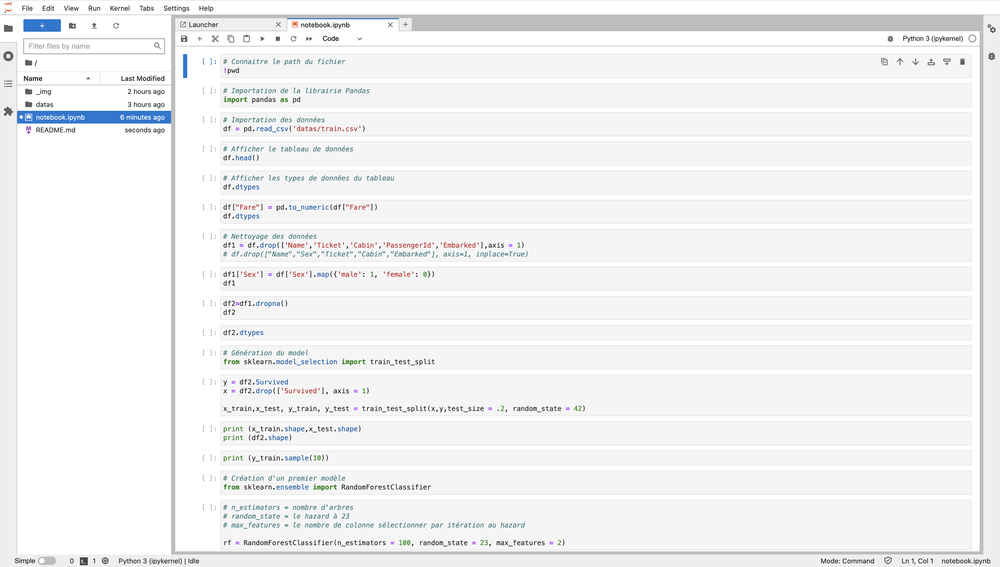

# **Section - AI** <a name="top"></a>

[Retour à l'accueil](../../)

## Sommaire

- 1 - [Pré-requis](#1)
- 2 - [Installation de Jupyter](#2)
  - 2.1 - [Préparation de l'environement](#2-1)
    - 2.1.1 - [MacOS](#2-1-1)
    - 2.1.2 - [Windows](#2-2-1)
  - 2.2 - [Construction de Jupyter](#2-2)
  - 2.3 - [Démarrer Jupyter](#2-3)
- 3 - [Jupyter - Utilisation](#3)
  - 3.1 - [Qu'est-ce qu'un Notebook dans Jupyter](#3-1)
  - 3.2 - [Exemple de création et de lecture d'un fichier Notebook](#3-2)
  - 3.3 - [Exemple d'exécution d'un fichier Notebook](#3-3)
- 4 - [Travaux pratiques](#4)
- 4.1 - [TP - Titanic](#4-1)
- 4.2 - [TP - Banque](#4-2)
- 4.2.1 - [Sujet du projet](#4-2-1)

## 1 - Pré-requis - [Haut de page](#top) <a name="1"></a>

- Python : **>=3.7** - **<3.11**

## 2 - Installation de Jupyter - [Haut de page](#top) <a name="2"></a>

### 2.1 - Préparation de l'environement - [Haut de page](#top) <a name="2-1"></a>

#### 2.1.1 - MacOS - [Haut de page](#top) <a name="2-1-1"></a>

```
python3 -m pip install --upgrade pip
python3 -m venv venv
source venv/bin/activate
pip install -r requirements.txt
```

#### 2.1.2 - Windows - [Haut de page](#top) <a name="2-1-2"></a>

```
python -m pip install --upgrade pip
python -m venv venv
. ./venv/Scripts/activate
pip install -r requirements.txt
```

> Si besoin : [source de jupyter](https://jupyter.org/install)

### 2.2 - Construction de Jupyter - [Haut de page](#top) <a name="2-2"></a>

```
jupyter lab build
```

### 2.3 - Démarrer Jupyter - [Haut de page](#top) <a name="2-3"></a>

```
jupyter-lab
```

Ouvrir normalement automatique une page web : http://localhost:8888/lab.


## 3 - Jupyter - Utilisation - [Haut de page](#top) <a name="3"></a>

### 3.1 - Qu'est-ce qu'un Notebook dans Jupyter - [Haut de page](#top) <a name="3-1-1"></a>

Un document Jupyter Notebook est un document JSON. Il suit un schéma contenant une liste ordonnée de cellules d'entrée/sortie. Celles-ci peuvent contenir du code, du texte (à l'aide de Markdown), des formules mathématiques, des graphiques et des médias interactifs. Ce document se termine généralement par l'extension ".ipynb".

[Source - wiki](https://fr.wikipedia.org/wiki/Jupyter#Jupyter_Notebook)

### 3.2 - Exemple de création et de lecture d'un fichier Notebook - [Haut de page](#top) <a name="3-2"></a>



### 3.3 - Exemple d'exécution d'un fichier Notebook - [Haut de page](#top) <a name="3-3"></a>


## 4 - Travaux pratiques - [Haut de page](#top) <a name="4"></a>

### 4.1 - TP - Titanic - [Haut de page](#top) <a name="4-1"></a>

Exemple d'étude de données réaliser en cours.

- Fichiers dispnobiles : 
  - [model_titanic.ipynb](model_titanic.ipynb)
  - [model_titanic.html](model_titanic.html)
  - /datas/
    - [titanic/gender_submission.csv](/datas/titanic/gender_submission.csv)
    - [titanic/test.csv](/datas/titanic/test.csv)
    - [titanic/train.csv](/datas/titanic/train.csv)
  
### 4.2 - TP - Banque - [Haut de page](#top) <a name="4-2"></a>

#### 4.2.1 - Sujet du projet - [Haut de page](#top) <a name="4-2-1"></a>

Prédire un accord de prêt bancaire

- Client : Fortuneo
- BDD : https://www.kaggle.com/code/mohamedadel7774/banking-dataset-with-5-different-models-techniques

- Fichiers dispnobiles : 
  - [notebook_Zchen.ipynb](notebook_Zchen.ipynb)
  - /datas/
    - [bank/bank-full.csv](/datas/bank/bank-full.csv)
    - [bank/bank-full-col-definition.txt](/datas/bank/bank-full-col-definition.txt)